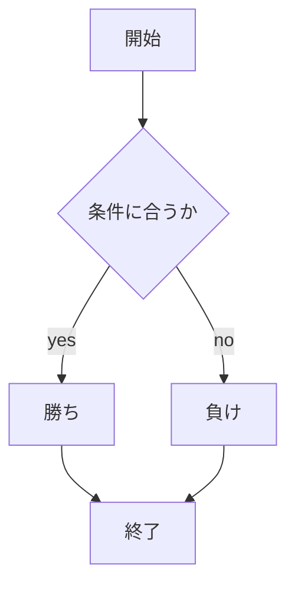
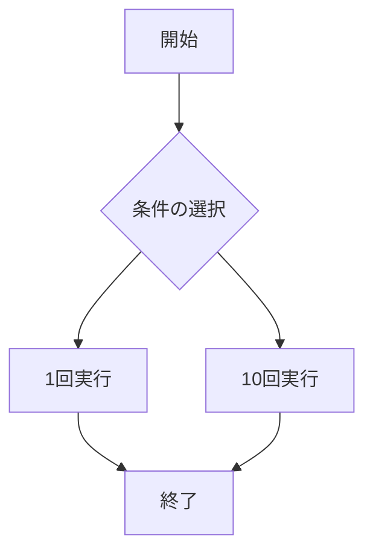
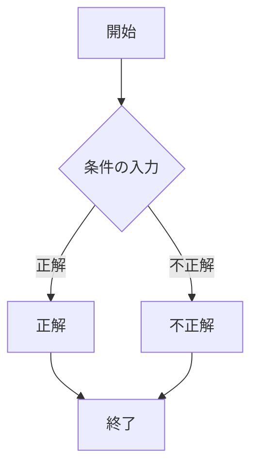

# webpro_06
10/29

## このプログラムについて
## ファイル一覧
ファイル名 | 説明
-|-
app5.js | プログラム本体
public/janken.html | じゃんけんの開始画面
views/icon.ejs|画像を表示する
views/luck.ejs|おみくじを表示する
views/show.ejs|挨拶を表示する
views/gacha.ejs|gachaテンプレートのエンジン
views/quiz.ejs|quizテンプレートのエンジン
public/Apple_logo_black.svg|ロゴの表示

### app5.js

```javascript

const express = require("express");
const app = express();

app.set('view engine', 'ejs');
app.use("/public", express.static(__dirname + "/public"));

app.get("/hello1", (req, res) => {
  const message1 = "Hello world";
  const message2 = "Bon jour";
  res.render('show', { greet1:message1, greet2:message2});
});

app.get("/hello2", (req, res) => {
  res.render('show', { greet1:"Hello world", greet2:"Bon jour"});
});

app.get("/icon", (req, res) => {
  res.render('icon', { filename:"./public/Apple_logo_black.svg", alt:"Apple Logo"});
});

app.get("/luck", (req, res) => {
  const num = Math.floor( Math.random() * 6 + 1 );
  let luck = '';
  if( num==1 ) luck = '大吉';
  else if( num==2 ) luck = '中吉';
  console.log( 'あなたの運勢は' + luck + 'です' );
  res.render( 'luck', {number:num, luck:luck} );
});

app.get("/janken", (req, res) => {
  let hand = req.query.hand;
  let win = Number(req.query.win) || 0;     // winのデフォルト値を0に設定
  let total = Number(req.query.total) || 0; // totalのデフォルト値を0に設定
  console.log({hand, win, total});

  const num = Math.floor(Math.random() * 3 + 1);
  let cpu = '';

  // CPUの手を決定
  if (num === 1) cpu = 'グー';
  else if (num === 2) cpu = 'チョキ';
  else cpu = 'パー';

  // 勝敗の判定ロジック
  let judgement = '';
  if (hand === cpu) {
    judgement = '引き分け';
  } else if (
    (hand === 'グー' && cpu === 'チョキ') ||
    (hand === 'チョキ' && cpu === 'パー') ||
    (hand === 'パー' && cpu === 'グー')
  ) {
    judgement = '勝ち';
    win += 1;
  } else {
    judgement = '負け';
  }
  total += 1;

  const display = {
    your: hand,
    cpu: cpu,
    judgement: judgement,
    win: win,
    total: total
  };
  res.render('janken', display);
});

app.get("/gacha", (req, res) => {
  const pulls = Number(req.query.pulls) || 0; 
  const results = [];

  if (pulls > 0) {
    for (let i = 0; i < pulls; i++) {
      const randomNum = Math.random();
      let result;

      if (randomNum < 0.05) {
        result = '白銀王者ライオウ';
      } else if (randomNum < 0.20) {
        result = '黄金王者エレファ';
      } else if (randomNum < 0.50) {
        result = '銅獣王者ハイーナ';
      
      } else {
        result = '郡獣王者ガーゼル';
      }

      results.push(result); 
    }
  }

  res.render('gacha', { results });
});

app.get("/quiz", (req, res) => {
  const answer = req.query.answer || ""; 
  const correctAnswers = ["ハサミ", "はさみ"]; 
  const clues = [
    "約6000年前に存在する。発明者は記録が残っていない。",
    "某有名なゲームに登場し、攻撃方法は一撃技である。",
    "身近なものであり、鋭い",
  ];


  const result = answer
    ? correctAnswers.includes(answer)
      ? "正解！"
      : "不正解！もう一度お願いします！"
    : "";

  res.render("quiz", { clues, answer, result });
});


app.listen(8080, () => console.log("Example app listening on port 8080!"));

```


### 元々あったプログラミング

共通設定としてapp.set('view engine', 'ejs');というテンプレートエンジンとしてEJSを使用することを指定というのがある。EJSテンプレートを使ってHTMLを生成する。

app.use("/public", express.static(__dirname + "/public"));は /public URLパスで静的ファイルを提供する。 CSS、画像、JavaScriptファイルなどの静的リソースを提供する。

###　それぞれのプログラミング

#### /hello1

message1 と message2 の2つの挨拶メッセージをクライアントに送信。

#### /hello2

固定メッセージ (Hello world と Bon jour) をテンプレートに渡して演算する。

#### /icon

 静的画像ファイルをテンプレートに渡して表示。

#### /luck

サイコロの目 (1～6) をランダムに生成し、運勢を表示。

#### /janken

手（グー、チョキ、パー）を入力として受け取り、CPUの手と比較して勝敗を判定。

勝利回数 (win) と合計ゲーム数 (total) を記録する。

処理の流れ:
手を入力し送信する。
サーバーがランダムにCPUの手を決定。
ユーザーの手とCPUの手を比較して結果を計算。
勝敗結果とスコアをテンプレートに渡して表示。





## 追加したプログラミング

### ガチャでよくある１回と１０回を選べる

```javascript
app.get("/gacha", (req, res) => {
  const pulls = Number(req.query.pulls) || 0; 
  const results = [];

  if (pulls > 0) {
    for (let i = 0; i < pulls; i++) {
      const randomNum = Math.random();
      let result;

      if (randomNum < 0.05) {
        result = '白銀王者ライオウ';
      } else if (randomNum < 0.20) {
        result = '黄金王者エレファ';
      } else if (randomNum < 0.50) {
        result = '銅獣王者ハイーナ';
      
      } else {
        result = '郡獣王者ガーゼル';
      }

      results.push(result); 
    }
  }

  res.render('gacha', { results });
});
```
/gachaは,webでアクセスするとこの関数が実行される。
(req.query.pulls)は追加データとして扱い、条件選択で指定された分ガチャを回し、その結果を表示させる。
初期状態では、値は0であるため何も表示されません。
const results = [];はガチャの結果を保存する配列。
if (pulls > 0)はpullsが0よりも大きい場合はにガチャ処理を実行する。

ガチャの確率判定(const randomNum = Math.random();)

確率(%)|名称('')
-|-
5%|'白銀王者ライオウ'
15%|'黄金王者エレファ'
30%|'銅獣王者ハイーナ'
50%|'郡獣王者ガーゼル'

これらの結果をresults 配列に追加する。

res.render('gacha', { results });でガチャの結果をweb上に表示する。

```ejs
<!DOCTYPE html>
<html>
<head>
  <title>野蛮猛獣</title>
</head>
<body>
  <h1>野蛮猛獣</h1>

  <% if (results.length > 0) { %>
    <ul>
      <% results.forEach(result => { %>
        <li><%= result %></li>
      <% }); %>
    </ul>
  <% } else { %>

  <% } %>

  <form action="/gacha" method="get">
    <button type="submit" name="pulls" value="1">1回実行</button>
    <button type="submit" name="pulls" value="10">10回実行</button>
  </form>
</body>
</html>

```

ガチャの結果をwebで表示し、ガチャを回すためのプログラミング

ガチャ結果のリスト表示

<% results.forEach(result =>によって配置内の各要素を<li>要素として表示する。

実行フォームの設置

<form action="/gacha" method="get">でボタンをクリックすると、送信されてボタンの値によって、ガチャの回数が変わる。




"http://localhost:8080/gacha"

をwebで実行するとこのプログラムが表示される。

これはボタンをクリックすることで動くプログラミング

### 印象操作クイズ

```javascript
app.get("/quiz", (req, res) => {
  const answer = req.query.answer || ""; 
  const correctAnswers = ["ハサミ", "はさみ"]; 
  const clues = [
    "約6000年前に存在する。発明者は記録が残っていない。",
    "某有名なゲームに登場し、攻撃方法は一撃技である。",
    "身近なものであり、鋭い",
  ];


  const result = answer
    ? correctAnswers.includes(answer)
      ? "正解！"
      : "不正解！もう一度お願いします！"
    : "";

  res.render("quiz", { clues, answer, result });
});

```
回答を送信すると、それを正解と比較し結果を含むページを表示させます。

const answer = req.query.answer || "";では回答の答えを取得し、回答が指定されていない場合は" "を初期の値として設定する。

const correctAnswers = ["ハサミ", "はさみ"];はクイズの正解となる回答のリスト。ひらがな・カタカナに対応できるよう、複数の正解をリストに入れてある。

const cluesはクイズのヒントを配列として定義し、ページにリスト形式で表示する。

結果の判定はanswer が指定されていれば、それが correctAnswers に含まれているかを判定して含まれていれば、

"正解！"

含まれていなければ 

"不正解！もう一度お願いします！"

また、回答していない場合（answer が"  "）、result は空になります。

res.render("quiz", { clues, answer, result });はクイズのヒントを表示させるプログラミングである。


```ejs

<!DOCTYPE html>
<html>
<head>
  <title>印象操作クイズ</title>
</head>
<body>
  <h1>印象操作クイズ</h1>
  <p>以下のヒントを参考に答えを考えてください。</p>

  <ul>
    <% clues.forEach(clue => { %>
      <li><%= clue %></li>
    <% }); %>
  </ul>

  <% if (result) { %>
    <p>あなたの答え: <%= answer %></p>
    <p>結果: <%= result %></p>
  <% } %>

  <form action="/quiz" method="get">
    <input type="text" name="answer" placeholder="答えを入力してください">
    <button type="submit">送信</button>
  </form>
</body>
</html>

```
ヒント、ユーザーの回答、結果を表示し、回答を入力するフォームを提供する。
タイトルと説明は<h 1>と< p >である。
<ul>でclues配列をリスト形式で表示。
回答と結果の表示は、受け取った結果がから出ない場合は、回答によって結果を正解か不正解かを表示する。
回答フォームは、<form action="/quiz" method="get">

によって入力できるようにする。

入力された値はanswerという名前で正解か不正解かを判定される。



"http://localhost:8080/quiz"

をwebで実行するとこのプログラムが表示される。


初回の表示は、アクセスするとヒントが表示される。
回答をしていないのであれば、結果や回答は表示されません。
回答の送信は、答えを入力し送信するとそれを形式で送信される。
サーバーでの処理は、答えを受け取り、それが正解であるかを判定する。
判定結果とヒントを再度送信する。
結果の表示は回答と結果が表示され、再挑戦する場合はフォームを使う。

