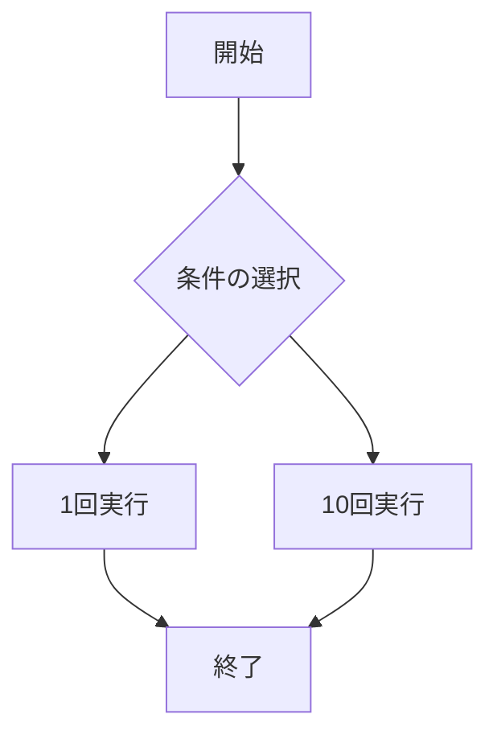

# webpro_06
10/29

## このプログラムについて
## ファイル一覧

ファイル名 | 説明
-|-
app5.js | プログラム本体
public/janken.html | じゃんけんの開始画面
views/gacha.ejs|gachaテンプレートのエンジン
views/quiz.ejs|quizテンプレートのエンジン

## 追加したプログラミング

### ガチャでよくある１回と１０回を選べる

```javascript
app.get("/gacha", (req, res) => {
  const pulls = Number(req.query.pulls) || 0; 
  const results = [];

  if (pulls > 0) {
    for (let i = 0; i < pulls; i++) {
      const randomNum = Math.random();
      let result;

      if (randomNum < 0.05) {
        result = '白銀王者ライオウ';
      } else if (randomNum < 0.20) {
        result = '黄金王者エレファ';
      } else if (randomNum < 0.50) {
        result = '銅獣王者ハイーナ';
      }else if (randomNum < 0.0000114514810) {
          result = '野獣先輩';
      } else {
        result = '郡獣王者ガーゼル';
      }

      results.push(result); 
    }
  }

  res.render('gacha', { results });
});
```


```ejs
<!DOCTYPE html>
<html>
<head>
  <title>野蛮猛獣</title>
</head>
<body>
  <h1>野蛮猛獣</h1>

  <% if (results.length > 0) { %>
    <ul>
      <% results.forEach(result => { %>
        <li><%= result %></li>
      <% }); %>
    </ul>
  <% } else { %>

  <% } %>

  <form action="/gacha" method="get">
    <button type="submit" name="pulls" value="1">1回実行</button>
    <button type="submit" name="pulls" value="10">10回実行</button>
  </form>
</body>
</html>

```





