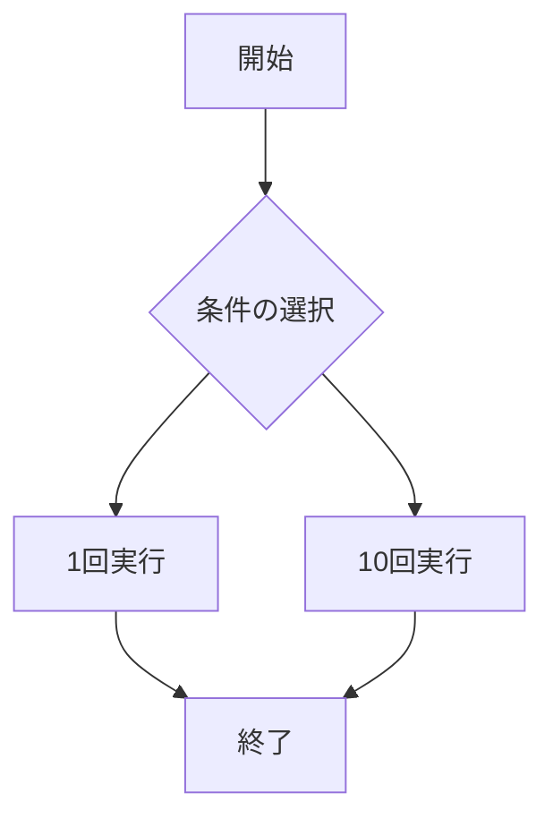

# webpro_06
10/29

## このプログラムについて
## ファイル一覧

ファイル名 | 説明
-|-
app5.js | プログラム本体
public/janken.html | じゃんけんの開始画面
views/gacha.ejs|gachaテンプレートのエンジン
views/quiz.ejs|quizテンプレートのエンジン

## 追加したプログラミング

### ガチャでよくある１回と１０回を選べる

```javascript
app.get("/gacha", (req, res) => {
  const pulls = Number(req.query.pulls) || 0; 
  const results = [];

  if (pulls > 0) {
    for (let i = 0; i < pulls; i++) {
      const randomNum = Math.random();
      let result;

      if (randomNum < 0.05) {
        result = '白銀王者ライオウ';
      } else if (randomNum < 0.20) {
        result = '黄金王者エレファ';
      } else if (randomNum < 0.50) {
        result = '銅獣王者ハイーナ';
      
      } else {
        result = '郡獣王者ガーゼル';
      }

      results.push(result); 
    }
  }

  res.render('gacha', { results });
});
```
/gachaは,webでアクセスするとこの関数が実行される。
(req.query.pulls)は追加データとして扱い、条件選択で指定された分ガチャを回し、その結果を表示させる。
初期状態では、値は0であるため何も表示されません。
const results = [];はガチャの結果を保存する配列。
if (pulls > 0)はpullsが0よりも大きい場合はにガチャ処理を実行する。

ガチャの確率判定(const randomNum = Math.random();)

確率(%)|名称('')
-|-
5%|'白銀王者ライオウ'
15%|'黄金王者エレファ'
30%|'銅獣王者ハイーナ'
50%|'郡獣王者ガーゼル'

これらの結果をresults 配列に追加する。

res.render('gacha', { results });でガチャの結果をweb上に表示する。

```ejs
<!DOCTYPE html>
<html>
<head>
  <title>野蛮猛獣</title>
</head>
<body>
  <h1>野蛮猛獣</h1>

  <% if (results.length > 0) { %>
    <ul>
      <% results.forEach(result => { %>
        <li><%= result %></li>
      <% }); %>
    </ul>
  <% } else { %>

  <% } %>

  <form action="/gacha" method="get">
    <button type="submit" name="pulls" value="1">1回実行</button>
    <button type="submit" name="pulls" value="10">10回実行</button>
  </form>
</body>
</html>

```

ガチャの結果をwebで表示し、ガチャを回すためのプログラミング

ガチャ結果のリスト表示

<% results.forEach(result =>によって配置内の各要素を<li>要素として表示する。

実行フォームの設置

<form action="/gacha" method="get">でボタンをクリックすると、送信されてボタンの値によって、ガチャの回数が変わる。




"http://localhost:8080/gacha"

をwebで実行するとこのプログラムが表示される。

これはボタンをクリックすることで動くプログラミング


```javascript
app.get("/quiz", (req, res) => {
  const answer = req.query.answer || ""; 
  const correctAnswers = ["ハサミ", "はさみ"]; 
  const clues = [
    "約6000年前に存在する。発明者は記録が残っていない。",
    "某有名なゲームに登場し、攻撃方法は一撃技である。",
    "身近なものであり、鋭い",
  ];


  const result = answer
    ? correctAnswers.includes(answer)
      ? "正解！"
      : "不正解！もう一度お願いします！"
    : "";

  res.render("quiz", { clues, answer, result });
});

```


```ejs

<!DOCTYPE html>
<html>
<head>
  <title>印象操作クイズ</title>
</head>
<body>
  <h1>印象操作クイズ</h1>
  <p>以下のヒントを参考に答えを考えてください。</p>

  <ul>
    <% clues.forEach(clue => { %>
      <li><%= clue %></li>
    <% }); %>
  </ul>

  <% if (result) { %>
    <p>あなたの答え: <%= answer %></p>
    <p>結果: <%= result %></p>
  <% } %>

  <form action="/quiz" method="get">
    <input type="text" name="answer" placeholder="答えを入力してください">
    <button type="submit">送信</button>
  </form>
</body>
</html>

```

```mermaid
flowchart TD;
start["開始"];
end1["終了"]
if{"条件の入力"}
1["正解"]
10["不正解"]

start --> if
if --> [正解]1
1 --> end1
if --> [不正解]10
10 --> end1
```


